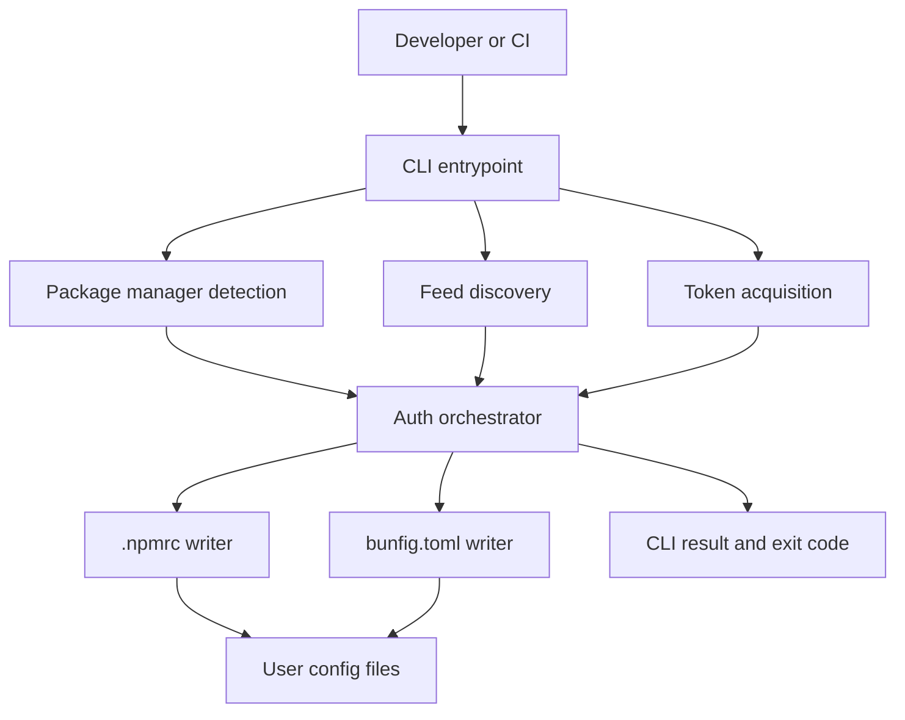

# Architecture

## Overview

The tool remains a small stateless CLI. It reads local project and user config, resolves the correct Azure DevOps registry context, obtains credentials from the best available source, and writes auth settings back to the appropriate package-manager config.

## System Diagram

## Key Components

### `src/cli.ts`

- Parse CLI arguments
- Handle terminal output and exit codes
- Call the core auth flow

### `src/index.ts`

- Expose a minimal programmatic API without making the library surface the primary product

### `src/lib/auth.ts`

- Coordinate detection, feed resolution, token lookup, and config writes
- Return structured success or failure results

### `src/lib/detect.ts`

- Infer the package manager from project lockfiles
- Fail clearly when the project contains conflicting package-manager indicators

### `src/lib/feed.ts`

- Parse and validate Azure DevOps registry/feed URLs from project config
- Inspect Bun project config first for Bun projects and fall back to project `.npmrc` when needed

### `src/lib/token.ts`

- Resolve credentials in priority order: cached input, CI env, Azure CLI

### `src/lib/npmrc.ts`

- Read and update `.npmrc`-compatible auth entries for npm and pnpm

### `src/lib/bunfig.ts`

- Read and update `bunfig.toml` auth entries for Bun
- Fail clearly when a discovered Bun feed cannot be represented by the scoped auth model

## Core Data Flow

1. User runs the CLI inside a project or CI job.
2. CLI detects the relevant package manager or returns an ambiguity error.
3. Feed discovery inspects project config to find Azure DevOps registry details, using Bun config first for Bun projects.
4. Token provider resolves the best available credential source.
5. Auth orchestrator normalizes credentials for the target package manager.
6. Config writer updates the user-level auth file.
7. CLI prints a concise result and exits with a documented stable code.

## Deployment Model

- Development: run directly with Bun
- Distribution: publish a Node-facing npm package and optional compiled binaries
- CI: install Bun and execute the CLI in scripted jobs
- State: no server-side state; only local user config is modified

## Design Constraints

- Keep modules small and independently testable
- Avoid classes; prefer pure functions and plain data structures
- Keep library code free of direct terminal side effects
- Limit writes to explicitly scoped config files
